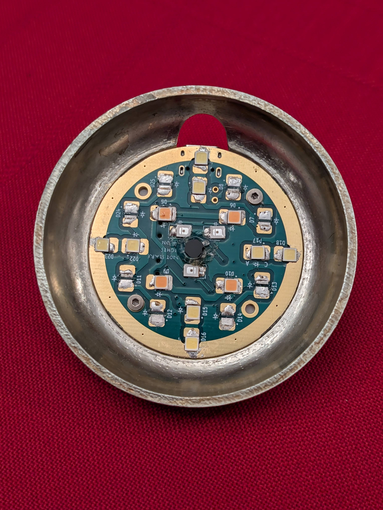

# uv_light
 Custom Sun Lamp / Full Spectrum Lamp
 
 Background writeup [here](https://syllepsis.live/2024/12/31/light-for-health-and-a-custom-sun-lamp/)

A heatsink is important. All 16 leds are too much, unfortunately.

Problem: the comparator circuit for voltage sensing doesn't work properly, and needs a look at.

Minor problem: there's one trace that is bridged by the heatsink here. Using a non conductive thermal pad between the pcb and heatsink solves that problem, or redesign.

Recommendation: add a switch to the UV circuit as well. Also perhaps use larger switches than those specced here if you intend to switch the active lights often.

